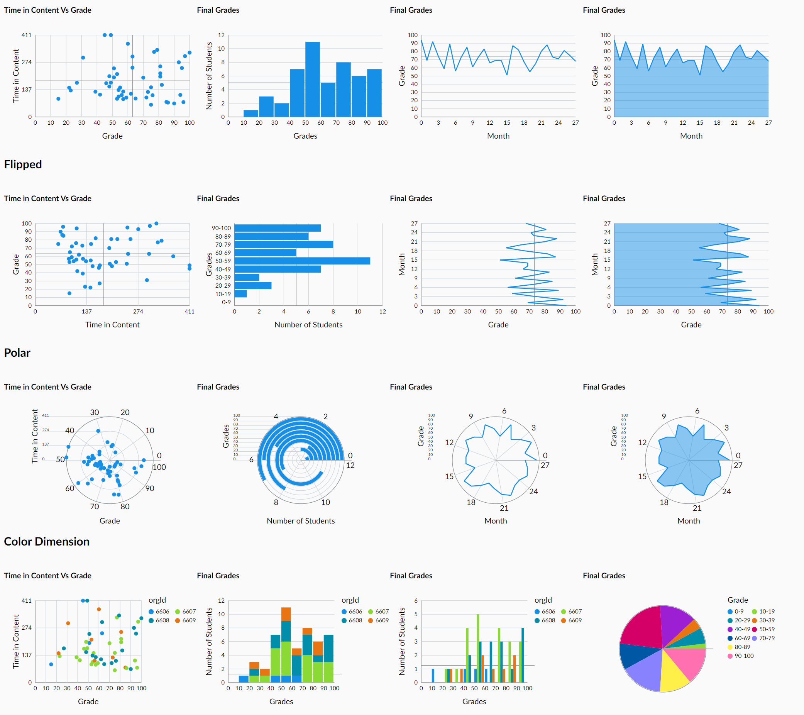

# \<gg-chart>

A lit-element component for creating data visualizations using the Grammar of Graphics.



## Installation

```bash
npm i @brightspaceuilabs/gg-chart
```

## Usage

```html
<script type="module">
  import 'gg-chart/src/gg-chart.js';
</script>

<gg-chart
  data='[{"grade": 82, "timeInContent": 78}, ...]'
  aes="grade, timeInContent"
  geom="point"
  scale='[{"name": "Grades"}, {"name": "Time in Content"}]'
  stats="ymean"
  theme="daylight"
  tooltip="point"
  width="300"
  height="250"
></gg-chart>
```

## Properties

### Events

- `@gg-chart-point-click` -> Point : Event is triggered when a point in the chart is clicked. Parameter is the point with its aesthetic values
- `@gg-chart-area-click` -> Area : Event is triggered when an area in the chart is clicked. Parameter is the point with its aesthetic values

### Attributes

- `aes` : The charts aesthetics, keys from the data records in axis order. 0 -> x, 1 -> y
- `geom` : The visual data representation. `bar`, `line`, `point`
- `scale` : A JSON string that defines the axis names, limits, and breaks.
- `stats` : Statistical additions, `xmean`, `ymean`, `bin:{width}`
- `coord` : Coordinate system, `polar:x`, `polar:y`, `flip`
- `tooltip` : Which elements you want the tooltip to show on, `point`, `area` 
- `pos` : Where the geoms should be positioned. `stacked`, `dodged`
- `theme` : The charts styling theme 
- `legend` : Toggles the legend, `hidden`. Only shows when special aesthetics are used.
- `data` : The data as a JSON string
- `width` : The width in pixels
- `height` : The height in pixels
- `.style` : A css object for selective styles.


## Linting and formatting

To scan the project for linting and formatting errors, run

```bash
npm run lint
```

To automatically fix linting and formatting errors, run

```bash
npm run format
```

## Testing with Web Test Runner

To execute a single test run:

```bash
npm run test
```

To run the tests in interactive watch mode run:

```bash
npm run test:watch
```


## Tooling configs

For most of the tools, the configuration is in the `package.json` to minimize the amount of files in your project.

If you customize the configuration a lot, you can consider moving them to individual files.

## Local Demo with `web-dev-server`

```bash
npm start
```

To run a local development server that serves the basic demo located in `demo/index.html`

## Tasks
Proof of Concept
- [x] Draws Axis
- [x] Draws labels and numbers
- [x] Draws headings
- [x] Accepts data
- [x] Keyboard navigable
- [x] Hovering shows tooltips
- [x] Updates when data changes
- [x] Animates when data changes
